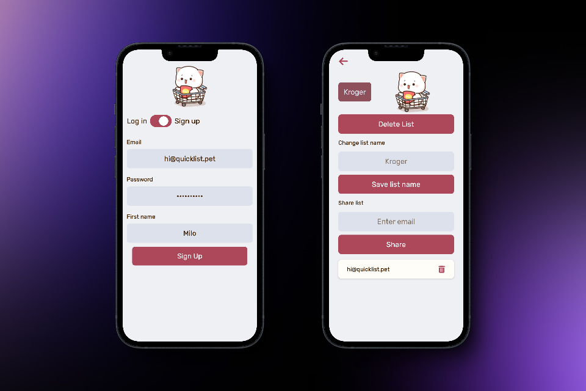

# Shopping-Cart: A Progressive Web App

## *Overview* 🧐
Despite all our advances in technology, shopping for groceries is still a time-consuming process. 

Over the years, I've tried several ways to create & share grocery lists (iMessages, ToDoist lists, the iOS Notes app, etc) but nothing has really met my needs. Some existing solutions are so complex they're unusable, while others look like they were designed in the 1990's.

Nearly all of my grocery shopping is done at 3 stores, and I buy the same things at regular intervals: bread, milk, cheese, butter, eggs, etc. I wanted an app that:
1. **Was simple and intuitive**: type the name of an item to add it to your list, tap an item in your list after you put it in your cart
2. **Was sharable & updated in real time**: one person can add things to the list while you're shopping--or two people can work off the same list to make shopping faster
3. **Supported multiple stores**: only seeing the things you want makes shopping much faster
4. **Had a pleasant design**: 

I decided to build 

## *Technical Details* 📝

✅ Built with TypeScript & React

✅ Data and Authentication from Firebase

## *Screenshots* 📷

## *Links* 🔗

[Live site](https://www.quicklist.pet) 👈

## *Project highlights* 🤓

🔳 **Firebase:** the *Realtime Database's* binary tree structure required careful data architecture--as well as *data transformation* on both import and export.

🔳 **Authentication:** required learning both the authentication APIs but also how to provide Authentication context to the app. 

🔳 **Organized components:** I everything in the app, from the buttons to the modals are reusable components. Once those were built, the rest of the app came together quickly.

🔳 **Domain regristration & hosting:** since I didn't use an all-in-one provider, I needed to configure the registrar to work with the hosting company 

🔳 **Sharing:** Allowing users to easily share lists required a lot of edge-case testing--especially when deleting shared lists 

## **Future feature sets** 🔮

🎯 **Auto populate lists** It will be easy to learn how often each user buys an item--and use that to suggest items they might need 

🎯 **Behavior-based sorting** For shoppers who take the same route through the store each time--items can be placed in the order they're checked off the list

🎯 **Anonymous app usage** Allow users to try the app without creating an account